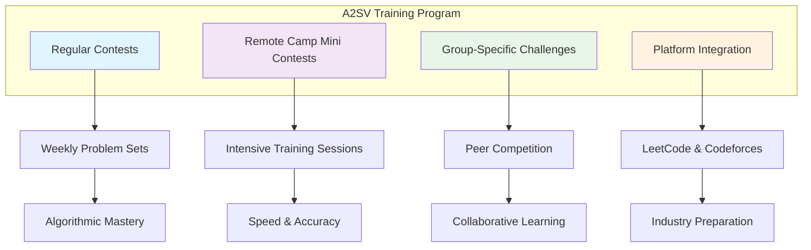
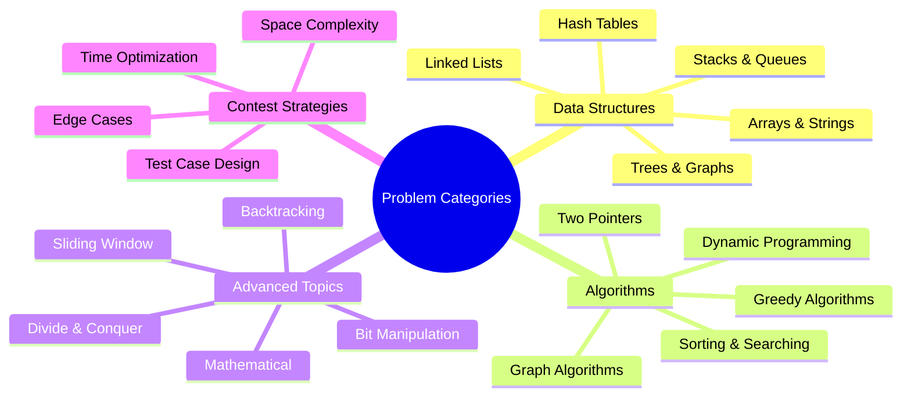
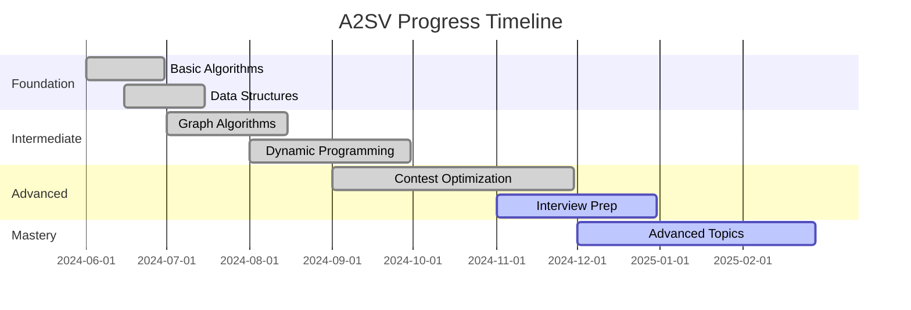

# A2SV Competitive Programming Solutions

**Comprehensive collection of algorithmic problem solutions from the Africa to Silicon Valley program**

## Overview

This repository showcases my journey through the prestigious **Africa to Silicon Valley (A2SV)** program, featuring solutions to over **470+ competitive programming problems** across multiple platforms. A2SV is a world-class software engineering training program that bridges the gap between African talent and Silicon Valley opportunities through intensive algorithmic problem-solving and technical interview preparation.

## Program Structure



| **Contest Type** | **Focus Area** | **Problem Count** | **Difficulty Range** |
|:---:|:---:|:---:|:---:|
| **Regular Contests** | Core algorithms | 150+ | Easy to Hard |
| **Remote Camp Mini** | Intensive training | 200+ | Medium to Expert |
| **Group G5 Challenges** | Peer competition | 120+ | Variable |
| **Platform Practice** | Interview prep | 470+ total | All levels |

## Technology Stack


## Problem Categories & Solutions



## Problem-Solving Journey



## Performance Metrics

### Problem Solving Statistics

| **Platform** | **Problems Solved** | **Success Rate** | **Average Time** |
|:---:|:---:|:---:|:---:|
| **LeetCode** | 250+ | 85% | 15-20 mins |
| **Codeforces** | 220+ | 78% | 20-30 mins |
| **A2SV Contests** | 470+ total | 82% | Variable |

### Skills Development

```mermaid
radar
    title Technical Skills Radar
    
    "Dynamic Programming" : 85
    "Graph Algorithms" : 80
    "Data Structures" : 90
    "Greedy Algorithms" : 85
    "Mathematical" : 75
    "String Processing" : 80
    "Tree Algorithms" : 85
    "Sorting & Searching" : 95
```

## Key Achievements

**Contest Highlights:**
- Consistent top 20% performance in A2SV weekly contests
- 470+ problems solved across multiple platforms
- Advanced from beginner to intermediate-advanced level
- Developed optimized Python templates for common patterns

**Skills Progression:**
- **Data Structures**: Arrays, LinkedLists, Trees, Graphs, Hash Tables
- **Algorithms**: DP, Greedy, Graph traversals, Sorting, Searching
- **Advanced Topics**: Bit manipulation, Mathematical algorithms
- **Optimization**: Time/Space complexity analysis and optimization

## Code Quality & Standards

### Python Implementation Standards

```python
# Example: Optimized solution structure
def solve_problem(input_data):
    """
    Problem: [Problem Name]
    Time Complexity: O(n)
    Space Complexity: O(1)
    Platform: LeetCode/Codeforces
    Contest: A2SV Remote Contest #X
    """
    # Implementation with clear comments
    # Edge case handling
    # Optimized approach
    return result

# Test cases and validation
def test_solution():
    # Comprehensive test cases
    pass
```

### Performance Optimization Techniques

- **Time Complexity**: Focus on optimal algorithmic approaches
- **Space Efficiency**: Memory-conscious implementations
- **Code Readability**: Clear, maintainable solutions
- **Edge Case Handling**: Robust error handling and validation

## Learning Resources & Templates

### Contest Strategy

1. **Problem Analysis** (2-3 minutes)
   - Read problem statement carefully
   - Identify input/output constraints
   - Recognize algorithmic patterns

2. **Solution Design** (5-10 minutes)
   - Choose optimal approach
   - Consider time/space complexity
   - Plan implementation strategy

3. **Implementation** (10-15 minutes)
   - Write clean, efficient code
   - Handle edge cases
   - Test with sample inputs

4. **Validation** (2-5 minutes)
   - Verify solution correctness
   - Check time/space constraints
   - Submit and debug if needed

## A2SV Program Impact

The **Africa to Silicon Valley** program has been instrumental in:

- **Technical Growth**: Systematic approach to problem-solving
- **Interview Preparation**: Real-world technical interview skills
- **Peer Learning**: Collaborative problem-solving with talented peers
- **Industry Readiness**: Preparation for top-tier tech companies
- **Community Building**: Connection with African tech talent network

## Future Goals

🎯 **Short-term Objectives:**
- Reach 500+ solved problems by Q1 2025
- Improve contest ranking to top 10%
- Master advanced topics (segment trees, advanced DP)
- Contribute to A2SV community resources

🚀 **Long-term Vision:**
- Secure internship/position at top tech company
- Mentor new A2SV participants
- Develop algorithmic problem-solving courses
- Bridge African talent with global opportunities

## Usage & Navigation

```bash
# Clone the repository
git clone https://github.com/dinariyasmine/A2SV.git
cd A2SV

# Navigate to specific contest
cd 2024-12-contests/contest-latest

# Run solution
python3 problem-A.py

# Test with custom input
python3 problem-A.py < test_input.txt
```

## Contributing to A2SV Community

This repository also serves as:
- **Learning Resource** for other A2SV participants
- **Solution Reference** for difficult problems
- **Best Practices** showcase for Python competitive programming
- **Progress Tracking** for personal development

## Contact & Collaboration

**A2SV Participant**  
**Contact:** ly_dinari@esi.dz  
**Program:** Africa to Silicon Valley Training Program  

*Connect with me for collaborative problem-solving, study groups, or A2SV program discussions!*

## Acknowledgments

**Special thanks to:**
- **[A2SV Program](https://a2sv.org/)** - World-class training and mentorship
- **[LeetCode](https://leetcode.com/)** - Comprehensive problem platform
- **[Codeforces](https://codeforces.com/)** - Competitive programming community
- **A2SV Mentors** - Guidance and technical expertise
- **Fellow Participants** - Collaborative learning and motivation

---

*This repository represents my dedication to algorithmic problem-solving and my journey toward becoming a software engineer through the A2SV program.*
